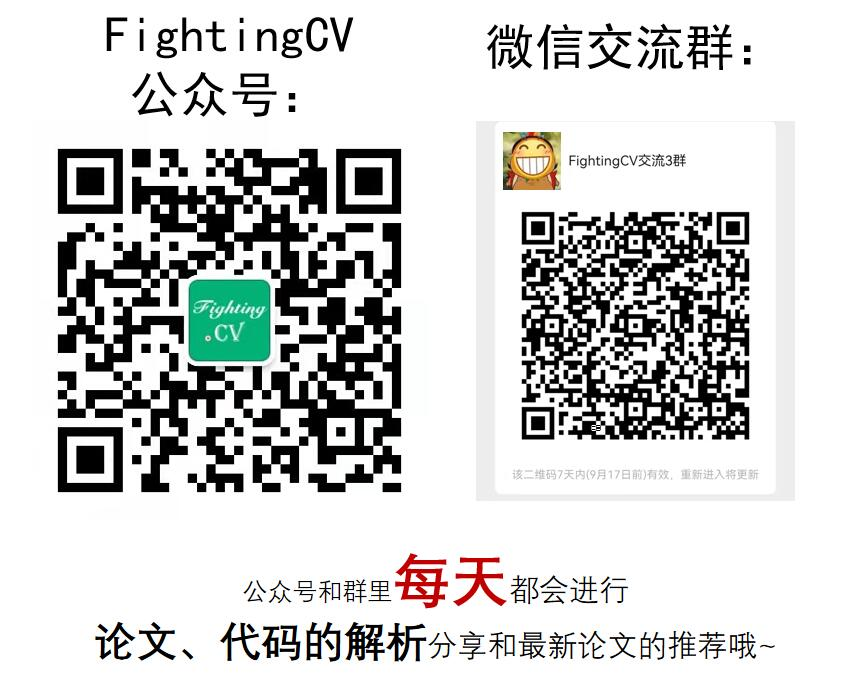

# CVAlgorithm

<!-- CV面试中的常见算法 -->

## TODO LIST
- [x] [pytorch分类算法](./classification.py)
- [x] [K-means](./kmeans/kmeans.py)
- [] [KNN]()
- [x] [NMS](./nms/nms.py)
- [] [PCA]()

***

## 1、用pytorch基于MLP实现分类流程
[用pytorch基于MLP实现分类流程](./classification.py)

***

## 2、用python实现kmeans
[2、用python实现kmeans](./kmeans/kmeans.py)

***

## 3、用python实现nms
[3、用python实现nms](./nms/nms.py)

***

## 4、pytorch的Resize插值方法
[4、pytorch的Resize插值方法](./resize/resize.py)

***

## 公众号 & 微信交流群

欢迎大家关注公众号：**FightingCV**

公众号**每天**都会进行**论文、算法和代码的干货分享**哦~

已建立**机器学习/深度学习算法/计算机视觉/多模态交流群**微信交流群！

**每天在群里分享一些近期的论文和解析**，欢迎大家一起**学习交流**哈~~~

强烈推荐大家关注[**知乎**](https://www.zhihu.com/people/jason-14-58-38/posts)账号和[**FightingCV公众号**](https://mp.weixin.qq.com/s/sgNw6XFBPcD20Ef3ddfE1w)，可以快速了解到最新优质的干货资源。